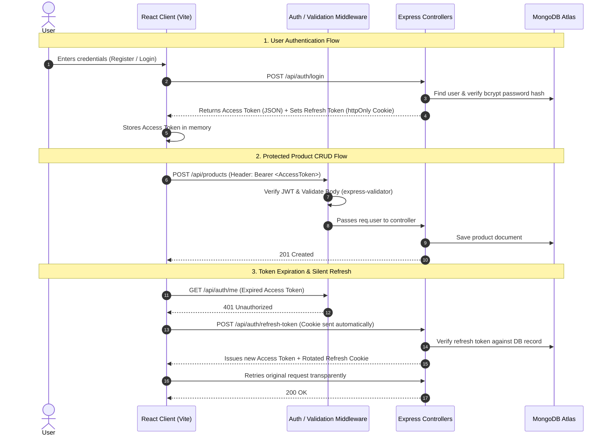

# 🛍️ Sheryians Store — Authentication & Product CRUD Platform

A complete, production-ready RESTful API and modern React frontend built for the **Sheryians Coding School** Full-Stack Assignment.

🌐 **Live Demo:** [https://sheryians-store.onrender.com](https://sheryians-store.onrender.com)  
📦 **GitHub Repository:** [https://github.com/kafeelraza/sheryians-auth-product-crud](https://github.com/kafeelraza/sheryians-auth-product-crud)

---

## 🌟 Key Features & Highlights

- **🔐 Dual-Token Authentication (JWT Access + Refresh Token)**:
  - **Access Token**: Short-lived (15 minutes), signed with `ACCESS_TOKEN_SECRET`, sent in JSON response and stored safely in memory.
  - **Refresh Token**: Long-lived (7 days), signed with `REFRESH_TOKEN_SECRET`, persisted in MongoDB on the User model for instant server-side revocation, and transmitted in an `httpOnly`, `SameSite`, `Secure` cookie.
  - **Seamless Token Refresh**: Axios response interceptor intercepts `401 Unauthorized` responses and automatically fetches a new access token via `/api/auth/refresh-token` in the background without interrupting the user.
- **🛡️ Field-Level Validation (`express-validator`)**:
  - Validates request body, query parameters, and MongoDB `:id` parameters.
  - Returns clear, field-by-field `400 Bad Request` responses so form errors display right next to the relevant inputs.
- **📦 Full Product CRUD Operations**:
  - Public read routes for browsing catalog (`GET /api/products`, `GET /api/products/:id`).
  - Protected write routes (`POST /api/products`, `PUT /api/products/:id`, `DELETE /api/products/:id`) guarded by `authenticate` middleware.
  - Real-time search, category filtering, and price sorting.
- **🎨 Modern React Frontend**:
  - Built with React 18, Vite, Tailwind CSS, Lucide Icons, and React Router DOM.
  - Responsive catalog, search bar, filter pills, Add/Edit modal dialogs, and delete confirmation popups.

---

## 🏗️ Architecture & Data Flow



---

## 📁 Project Directory Structure

```
sheryians-auth-product-crud/
├── backend/
│   ├── src/
│   │   ├── config/
│   │   │   └── db.js                 # MongoDB connection setup
│   │   ├── controllers/
│   │   │   ├── auth.controller.js     # Register, Login, Refresh, Logout, Me
│   │   │   └── product.controller.js  # Create, Read, Update, Delete products
│   │   ├── middlewares/
│   │   │   ├── auth.middleware.js     # JWT Bearer token authentication
│   │   │   ├── validate.middleware.js # express-validator error formatter
│   │   │   └── error.middleware.js    # Global error & 404 handler
│   │   ├── models/
│   │   │   ├── User.js                # User schema with bcrypt pre-save hook
│   │   │   └── Product.js             # Product schema with validations
│   │   ├── routes/
│   │   │   ├── auth.routes.js         # /api/auth router
│   │   │   ├── product.routes.js      # /api/products router
│   │   │   └── index.js               # Main API router aggregator
│   │   ├── utils/
│   │   │   ├── jwt.js                 # Token signing, verification & cookie options
│   │   │   └── apiResponse.js         # Standard JSON response helpers
│   │   ├── validators/
│   │   │   ├── auth.validator.js      # Validation chains for auth endpoints
│   │   │   └── product.validator.js   # Validation chains for product endpoints
│   │   └── app.js                     # Express app setup & static file serving
│   ├── seed.js                        # Database seeder with sample catalog
│   ├── server.js                      # Server startup entry point
│   └── test-api.js                    # Automated integration test suite (15 tests)
├── frontend/
│   ├── src/
│   │   ├── api/
│   │   │   └── client.js              # Axios instance with 401 refresh interceptor
│   │   ├── components/
│   │   │   ├── Navbar.jsx             # Top navigation bar
│   │   │   ├── ProductCard.jsx        # Product catalog card
│   │   │   ├── ProductModal.jsx       # Modal for Add / Edit product
│   │   │   ├── DeleteConfirmModal.jsx # Deletion confirmation popup
│   │   │   └── ProtectedRoute.jsx     # Route guard component
│   │   ├── context/
│   │   │   └── AuthContext.jsx        # Global Auth state provider
│   │   ├── pages/
│   │   │   ├── Login.jsx              # Sign-in page
│   │   │   ├── Register.jsx           # Sign-up page with auto-login
│   │   │   ├── Products.jsx           # Catalog page with search, filter, and CRUD
│   │   │   ├── ProductDetail.jsx      # Product specs and single view
│   │   │   └── Profile.jsx            # User account details and security info
│   │   ├── App.jsx                    # Routing configuration
│   │   ├── main.jsx                   # React root entry
│   │   └── index.css                  # Tailwind styles
│   ├── index.html
│   ├── package.json
│   ├── tailwind.config.js
│   └── vite.config.js
├── package.json                       # Unified build and start scripts
└── README.md
```

---

## 📖 Complete API Reference

### 🔐 Authentication APIs (`/api/auth`)

| Method | Endpoint | Access | Description |
| :--- | :--- | :--- | :--- |
| `POST` | `/api/auth/register` | Public | Register new user. Hashes password (min 10 salt rounds), returns 201 (no tokens). |
| `POST` | `/api/auth/login` | Public | Authenticates user, issues access token in body + refresh token in `httpOnly` cookie. |
| `POST` | `/api/auth/refresh-token` | Public* | Validates refresh token from cookie/DB, issues new access token (+ token rotation). |
| `POST` | `/api/auth/logout` | Authenticated | Invalidates stored refresh token in DB and clears the cookie. |
| `GET` | `/api/auth/me` | Authenticated | Returns current authenticated user profile. |

#### Sample Register Request (`POST /api/auth/register`)
```json
{
  "name": "Aman Verma",
  "email": "aman@example.com",
  "password": "Password123",
  "confirmPassword": "Password123"
}
```
**Success Response (201 Created):**
```json
{
  "success": true,
  "message": "User registered successfully. Please log in.",
  "data": {
    "user": {
      "_id": "66f9ab12c345...",
      "name": "Aman Verma",
      "email": "aman@example.com",
      "createdAt": "2026-09-28T12:00:00.000Z"
    }
  }
}
```

#### Sample Validation Error (400 Bad Request)
```json
{
  "success": false,
  "message": "Validation failed",
  "errors": [
    {
      "field": "confirmPassword",
      "message": "Passwords do not match",
      "value": "WrongPassword"
    }
  ]
}
```

---

### 📦 Product CRUD APIs (`/api/products`)

| Method | Endpoint | Access | Description |
| :--- | :--- | :--- | :--- |
| `GET` | `/api/products` | Public | List products (supports query params: `search`, `category`, `sort`, `page`, `limit`). |
| `GET` | `/api/products/:id` | Public | Get single product by MongoDB `:id`. |
| `POST` | `/api/products` | Authenticated | Create a new product (attached to `req.user._id`). |
| `PUT` | `/api/products/:id` | Authenticated | Update existing product details. |
| `DELETE` | `/api/products/:id` | Authenticated | Delete a product from catalog. |

#### Sample Create Product Request (`POST /api/products`)
```json
{
  "title": "Sony WH-1000XM5 Wireless Headphones",
  "description": "Industry-leading noise canceling headphones with crystal-clear hands-free calling.",
  "price": 398.00,
  "category": "Audio",
  "stock": 25,
  "imageUrl": "https://images.unsplash.com/photo-1505740420928-5e560c06d30e"
}
```

---

## 🛠️ Local Development & Setup

### Prerequisites
- [Node.js](https://nodejs.org/) (v18+)
- [MongoDB](https://www.mongodb.com/) (Local instance or MongoDB Atlas)

---

### 1. Clone the Repository
```bash
git clone https://github.com/kafeelraza/sheryians-auth-product-crud.git
cd sheryians-auth-product-crud
```

### 2. Configure Environment Variables
Create a `.env` file inside the `backend` folder:
```bash
cp backend/.env.example backend/.env
```
Fill in your secrets:
```env
PORT=5000
NODE_ENV=development
MONGODB_URI=mongodb://127.0.0.1:27017/sheryians_ecommerce
ACCESS_TOKEN_SECRET=your_access_token_secret_here
ACCESS_TOKEN_EXPIRY=15m
REFRESH_TOKEN_SECRET=your_refresh_token_secret_here
REFRESH_TOKEN_EXPIRY=7d
CLIENT_URL=http://localhost:5173
```

### 3. Run Backend & Frontend

**Terminal 1 (Backend):**
```bash
cd backend
npm install
node seed.js      # Seed initial sample products and admin user
npm run dev       # Starts server at http://localhost:5000
```

**Terminal 2 (Frontend):**
```bash
cd frontend
npm install
npm run dev       # Starts Vite dev server at http://localhost:5173
```

---

## 🧪 Automated Testing

An automated end-to-end integration test runner verifies all 15 core assignment requirements:
```bash
cd backend
node test-api.js
```
**Test Coverage:**
- Input validation failures & password mismatch (400 Bad Request)
- Duplicate email rejection (409 Conflict)
- Invalid credentials (generic 401 Unauthorized)
- Dual-token issuance (Access token body + httpOnly refresh cookie)
- Protected route authorization via Bearer token
- Silent token refresh & token rotation
- Full CRUD lifecycle on product resources
- Token invalidation on logout & rejection of revoked tokens

---

## 🎓 Viva & Technical Review Cheatsheet

### 1. Why use Access Token + Refresh Token instead of a single long-lived token?
- **Security**: Access tokens are short-lived (15 minutes). If stolen, the attacker has a very small window of opportunity.
- **Revocation**: JWTs are stateless and cannot be revoked without changing the secret. Refresh tokens are stored in the database. When a user clicks **Logout**, we set `user.refreshToken = null` in MongoDB, instantly revoking access once the 15-minute access token expires.

### 2. Why store Refresh Token in an `httpOnly` Cookie?
- JavaScript running in the browser cannot access `httpOnly` cookies, preventing **Cross-Site Scripting (XSS)** token theft.
- Browsers automatically attach cookies to same-origin requests with `credentials: true`.

### 3. How does `express-validator` middleware handle errors?
- Validation chains (e.g. `body('email').isEmail()`, `body('password').isLength({ min: 6 })`) validate inputs.
- The `validate.middleware.js` runs immediately after and checks `validationResult(req)`. If errors exist, it halts execution and returns `{ success: false, errors: [...] }` with status `400`. Controller logic never executes on invalid data.

### 4. How does the frontend handle token expiry seamlessly?
- In `frontend/src/api/client.js`, an **Axios Response Interceptor** listens for `401 Unauthorized`.
- It pauses pending requests, calls `/api/auth/refresh-token`, updates the in-memory access token, and seamlessly retries the original request without logging the user out.

---

## 📄 License
This project is open-source and built for educational purposes under the MIT License.
