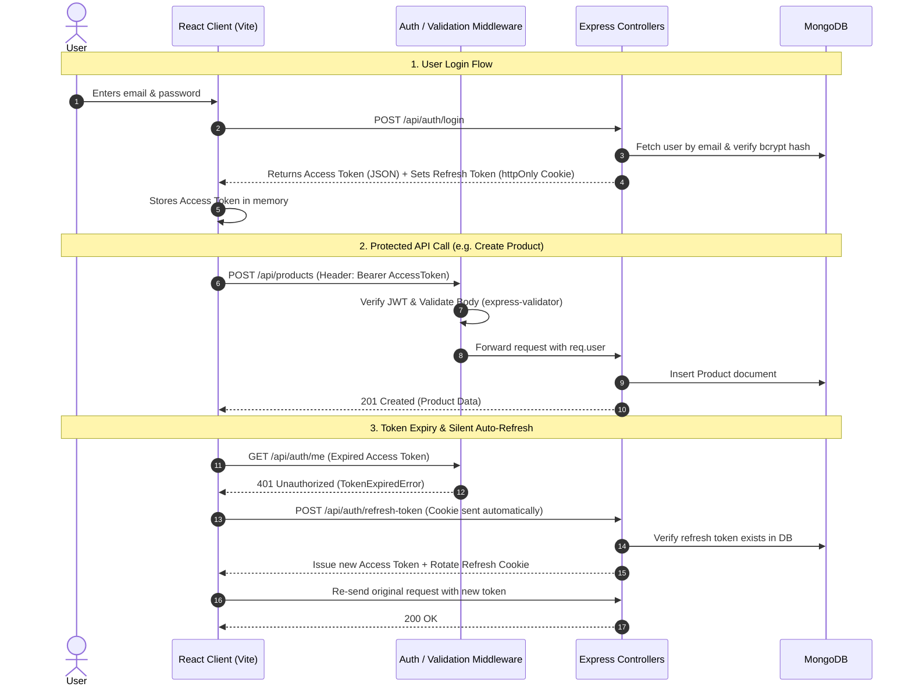

# 🛍️ Sheryians Store — Authentication & Product CRUD Platform

A production-grade, secure RESTful API and modern React frontend built for the **Sheryians Coding School** Full-Stack Assignment.

---

## 🌟 Key Highlights & Features

- **🔐 Dual-Token Authentication System**:
  - **Access Token**: Short-lived (15 minutes), signed with `ACCESS_TOKEN_SECRET`, sent in JSON body and stored safely in frontend memory.
  - **Refresh Token**: Long-lived (7 days), signed with `REFRESH_TOKEN_SECRET`, stored in database for instantaneous server-side revocation, and transmitted strictly inside an `httpOnly`, `SameSite`, `Secure` cookie.
  - **Seamless Refresh Interceptor**: The frontend uses an Axios response interceptor that automatically calls `/api/auth/refresh-token` on any `401 Unauthorized` and retries the failed request in the background without disturbing the user session.
- **🛡️ Request Validation with `express-validator`**:
  - Every route input (body fields, query parameters, route params like `:id`) is strictly validated.
  - Returns clean, structured field-level `400 Bad Request` responses so the UI displays errors right next to the corresponding form inputs.
- **📦 Full Product CRUD Operations**:
  - Create, Read (List & Single), Update, and Delete products with authentication guards on write actions.
  - Includes real-time catalog search, category filtering, and sorting.
- **🎨 Modern Responsive UI**:
  - Built with React (Vite) + Tailwind CSS + Lucide Icons.
  - Features toast notifications, animated modals, skeleton loading states, and dark aesthetic.

---

## 🏗️ Architecture & Data Flow



---

## 📁 Project Structure

```
sheryians-auth-product-crud/
├── backend/
│   ├── src/
│   │   ├── config/
│   │   │   └── db.js                 # MongoDB connection logic
│   │   ├── controllers/
│   │   │   ├── auth.controller.js     # Register, Login, Refresh, Logout, Me
│   │   │   └── product.controller.js  # Create, Read, Update, Delete products
│   │   ├── middlewares/
│   │   │   ├── auth.middleware.js     # JWT Bearer token authentication
│   │   │   ├── validate.middleware.js # express-validator error formatter
│   │   │   └── error.middleware.js    # Global error & 404 handler
│   │   ├── models/
│   │   │   ├── User.js                # User schema with bcrypt pre-save hook
│   │   │   └── Product.js             # Product schema with validations
│   │   ├── routes/
│   │   │   ├── auth.routes.js         # /api/auth routes
│   │   │   ├── product.routes.js      # /api/products routes
│   │   │   └── index.js               # Main API router aggregator
│   │   ├── utils/
│   │   │   ├── jwt.js                 # Token signing, verifying & cookie options
│   │   │   └── apiResponse.js         # Standard JSON response helpers
│   │   ├── validators/
│   │   │   ├── auth.validator.js      # Validation chains for auth
│   │   │   └── product.validator.js   # Validation chains for products
│   │   └── app.js                     # Express app setup & CORS config
│   ├── .env.example
│   ├── .env
│   ├── package.json
│   ├── seed.js                        # Database seeder with sample products
│   ├── server.js                      # Server startup entry point
│   └── test-api.js                    # Automated integration test suite
├── frontend/
│   ├── src/
│   │   ├── api/
│   │   │   └── client.js              # Axios instance with 401 refresh interceptor
│   │   ├── components/
│   │   │   ├── Navbar.jsx             # Navigation bar with dynamic auth actions
│   │   │   ├── ProductCard.jsx        # Product display card with action buttons
│   │   │   ├── ProductModal.jsx       # Modal for Add / Edit product
│   │   │   ├── DeleteConfirmModal.jsx # Deletion confirmation popup
│   │   │   └── ProtectedRoute.jsx     # Route guard component
│   │   ├── context/
│   │   │   └── AuthContext.jsx        # Global Auth state provider
│   │   ├── pages/
│   │   │   ├── Login.jsx              # Sign-in page with validation error handling
│   │   │   ├── Register.jsx           # Sign-up page with confirm password check
│   │   │   ├── Products.jsx           # Catalog page with search, filter, and CRUD
│   │   │   ├── ProductDetail.jsx      # Product specs and single view
│   │   │   └── Profile.jsx            # User account details and security info
│   │   ├── App.jsx                    # Routing configuration
│   │   ├── main.jsx                   # React root entry
│   │   └── index.css                  # Tailwind styles
│   ├── index.html
│   ├── package.json
│   ├── tailwind.config.js
│   └── vite.config.js
└── README.md
```

---

## ⚙️ Installation & Setup

### Prerequisites
- [Node.js](https://nodejs.org/) (v18 or newer)
- [MongoDB](https://www.mongodb.com/) (Local server or MongoDB Atlas cluster)

---

### Step 1: Backend Setup

1. Open a terminal and navigate to the backend directory:
   ```bash
   cd backend
   ```
2. Install dependencies:
   ```bash
   npm install
   ```
3. Create your `.env` configuration file:
   ```bash
   cp .env.example .env
   ```
   *Sample `.env` contents:*
   ```env
   PORT=5000
   NODE_ENV=development
   MONGODB_URI=mongodb://127.0.0.1:27017/sheryians_ecommerce
   ACCESS_TOKEN_SECRET=your_access_token_super_secret_key_2026
   ACCESS_TOKEN_EXPIRY=15m
   REFRESH_TOKEN_SECRET=your_refresh_token_super_secret_key_2026
   REFRESH_TOKEN_EXPIRY=7d
   CLIENT_URL=http://localhost:5173
   ```
4. Seed the database with sample products and an admin user:
   ```bash
   node seed.js
   ```
   *(Creates admin: `admin@sheryians.com` | password: `adminPassword123`)*
5. Start the backend development server:
   ```bash
   npm run dev
   ```
   *Backend will run at: `http://localhost:5000`*

---

### Step 2: Frontend Setup

1. Open another terminal and navigate to the frontend directory:
   ```bash
   cd frontend
   ```
2. Install dependencies:
   ```bash
   npm install
   ```
3. Start the Vite development server:
   ```bash
   npm run dev
   ```
   *Frontend will run at: `http://localhost:5173`*

---

## 🧪 Running the Automated API Test Suite

The project includes an end-to-end integration test runner testing all 15 core requirements (validation errors, conflict handling, password hashing, JWT cookies, token rotation, CRUD endpoints, and revocation on logout).

To run the automated tests:
```bash
cd backend
node test-api.js
```

---

## 📖 API Documentation Reference

### 🔐 Authentication Endpoints (`/api/auth`)

| Method | Endpoint | Access | Description |
| :--- | :--- | :--- | :--- |
| `POST` | `/api/auth/register` | Public | Register new user. Hashes password (min 10 rounds), returns 201 (no tokens). |
| `POST` | `/api/auth/login` | Public | Authenticates user, issues access token in body + refresh token in `httpOnly` cookie. |
| `POST` | `/api/auth/refresh-token` | Public* | Validates refresh token from cookie/DB, issues new access token (+ token rotation). |
| `POST` | `/api/auth/logout` | Authenticated | Invalidates stored refresh token in DB and clears the cookie. |
| `GET` | `/api/auth/me` | Authenticated | Returns current authenticated user profile. |

#### Sample Register Request (`POST /api/auth/register`)
```json
{
  "name": "Jane Doe",
  "email": "jane@example.com",
  "password": "Password123",
  "confirmPassword": "Password123"
}
```
**Success Response (201 Created):**
```json
{
  "success": true,
  "message": "User registered successfully. Please log in.",
  "data": {
    "user": {
      "_id": "66f9ab12c345...",
      "name": "Jane Doe",
      "email": "jane@example.com",
      "createdAt": "2026-09-28T12:00:00.000Z"
    }
  }
}
```

#### Sample Validation Error (400 Bad Request)
```json
{
  "success": false,
  "message": "Validation failed",
  "errors": [
    {
      "field": "confirmPassword",
      "message": "Passwords do not match",
      "value": "WrongPassword"
    }
  ]
}
```

---

### 📦 Product CRUD Endpoints (`/api/products`)

| Method | Endpoint | Access | Description |
| :--- | :--- | :--- | :--- |
| `GET` | `/api/products` | Public | List products (supports `search`, `category`, `sort`, `page`, `limit`). |
| `GET` | `/api/products/:id` | Public | Get single product by MongoDB `:id`. |
| `POST` | `/api/products` | Authenticated | Create a new product (attached to `req.user._id`). |
| `PUT` | `/api/products/:id` | Authenticated | Update existing product details. |
| `DELETE` | `/api/products/:id` | Authenticated | Delete a product from catalog. |

#### Sample Create Product Request (`POST /api/products`)
```json
{
  "title": "Bose QuietComfort Ultra",
  "description": "Spatial audio with world-class noise cancellation and custom modes.",
  "price": 429.00,
  "category": "Audio",
  "stock": 30,
  "imageUrl": "https://images.unsplash.com/photo-1505740420928-5e560c06d30e"
}
```

---

## 🎓 Code Understanding & Viva / Review Cheatsheet

If an instructor asks you to explain any part of this codebase, here is how each part works:

### 1. Why do we use Access Token + Refresh Token instead of just one token?
> **Answer**:
> - **Security**: If an access token has a long lifetime and gets stolen (e.g. via XSS), an attacker has prolonged access. Making access tokens **short-lived (15 minutes)** limits the attack window.
> - **Revocation**: JWT tokens are stateless by default and cannot be revoked without changing secrets. The **refresh token is stored in the database**. When a user clicks "Logout" or gets blocked, we set `refreshToken = null` in the database. When the access token expires in 15 mins, the refresh attempt is rejected immediately!

### 2. Why store Refresh Token in an `httpOnly` cookie?
> **Answer**:
> An `httpOnly` cookie cannot be read or stolen by JavaScript code in the browser (protecting against Cross-Site Scripting / XSS attacks). Browsers automatically attach cookies to same-origin and credentials-enabled requests.

### 3. How does `express-validator` work in this project?
> **Answer**:
> - We define validation chains (e.g. `body('email').isEmail()`, `body('password').isLength({ min: 6 })`).
> - The `validate.middleware.js` runs right after the validator chain and inspects `validationResult(req)`.
> - If errors exist, it halts the request and returns an array of field-level errors `{ field, message }` with HTTP `400`. The controller logic is never executed with invalid data.

### 4. How does the frontend handle token expiry without logging the user out?
> **Answer**:
> In `frontend/src/api/client.js`, we configure an **Axios Response Interceptor**. When an API call returns `401 Unauthorized`, the interceptor intercepts the error, calls `/api/auth/refresh-token` behind the scenes, stores the fresh access token, and seamlessly replays the user's initial request.

---

## 🚀 Live Deployment Guide

1. **Backend**: Deploy on [Render](https://render.com) or [Railway](https://railway.app) with environment variables (`MONGODB_URI`, `ACCESS_TOKEN_SECRET`, `REFRESH_TOKEN_SECRET`, `CLIENT_URL`).
2. **Database**: Create a free MongoDB database cluster on [MongoDB Atlas](https://www.mongodb.com/atlas).
3. **Frontend**: Deploy on [Vercel](https://vercel.com) or [Netlify](https://netlify.com) pointing to your live backend URL.
